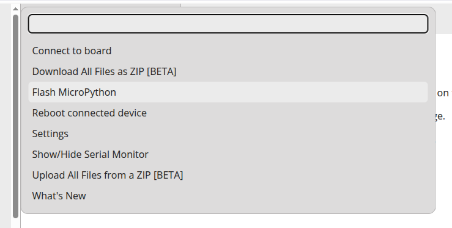

# About the Command Palette

<small>There are quite a few commands you can use</small>

To access the command palette, you can use the keyboard shortcut `Ctrl+Shift+P` or click the command palette in the bottom right corner of the IDE.

## Connect to Board

This command is identical to clicking the Connect to Board button on the bar on the bottom of MicroMonkey. It launches the select a serial port dialog if no board is connected, or disconnects the board if a board is already connected.

## Download All Files as ZIP

This command reads all files from the board connected and downloads it as a ZIP file to your computer. This can take a minute to complete.

If no board is connected, nothing will happen.

## Flash MicroPython

This command opens the MicroPython Flasher after asking you what type of board is connected. You will then be presented with a step-by-step flash process. See the documentation on [Flashing MicroPython](/docs/flash-micropython) for more information.

## Reboot connected device

This command will soft-reboot the connected device, the equivalent of executing the command `Ctrl+D` in the serial monitor.

## Settings

This command opens the settings page, same as pressing the settings button in the bottom of the IDE.

## Show/Hide Serial Monitor

Toggles the visibility of the [Serial Monitor](/docs/serial-monitor), same as pressing the button in the bottom or pressing `` Ctrl+Shift+` ``

## Upload All Files from a ZIP

Uploads all the files from a ZIP. This will mirror the exact structure of the zip, so keep in mind if zipping a folder to upload, you'll want to zip just the contents and not the folder itself.

ZIPs generated by MicroMonkey will upload the same as the files looked like before.

## What's New

Opens a tab in MicroMonkey displaying the latest changes.

## [Git] Enable

If a Git repo has not been created for this board, this command will show, allowing you to create a new Git repo.

## [Git] Commit Staged Changes

Commit changes that have been staged in the Git panel. This command will only show if a Git repo is enabled for the connected board.

## [Git] Download .git folder as ZIP

Downloads the `.git` folder of the active repository as a .zip file.

## [Git] Open Commit History

Opens the Commit History tab, displaying all of the commits made in the active Git repo.

## [Git] Reload

If a change has been made to a file using something other than MicroMonkey, for example, if a Python program on the board has modified a file, this command may need to be executed to bring the Git repo up to date on the most recent changes.

Typically you won't need to use this command as file operations within MicroMonkey will update Git automatically.

## [Git] Add/update remote

Adds or updates the remote associated with the current git repo.

[See documentation on git for more information.](/docs/git).

## [Git] Push

Pushes local commits to the associated git remote. If there are conflicts, you will get an error.

[See documentation on git for more information.](/docs/git).

## [Git] Pull

Pulls changes from the remote. Unlike `[Git] Push`, this command will allow merge conflicts, and will write conflict markers to the board.

[See documentation on git for more information.](/docs/git).